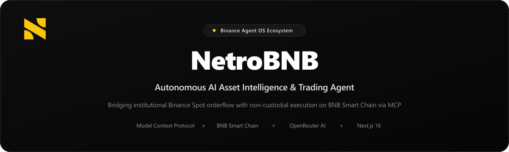
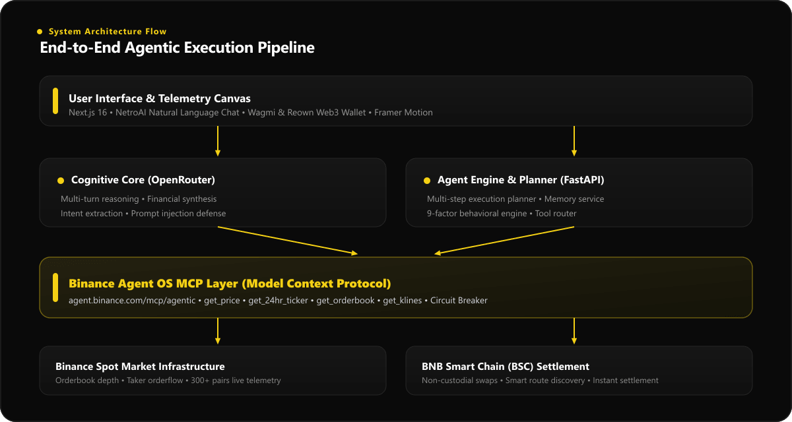
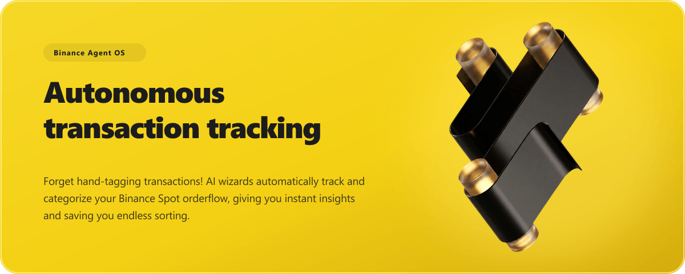

<p align="center">
  
</p>

<p align="center">
  <a href="https://github.com/AbdullahBalfaqih/NetroBNB"></a>
  <a href="https://bnbchain.org"></a>
  <a href="https://modelcontextprotocol.io"></a>
  <a href="https://openrouter.ai"></a>
</p>

<p align="center">
  
  
  
  
  
  
  
</p>

---

## Project Description & Overview

**NetroBNB** is an autonomous digital asset intelligence and quantitative trading agent engineered for decentralized finance. It establishes a high-throughput bridge connecting live **Binance Spot market infrastructure** via the **Model Context Protocol (MCP)** with non-custodial decentralized execution on the **BNB Smart Chain (BSC)**.

Digital asset trading often suffers from emotional bias, delayed telemetry, and fragmented execution. NetroBNB addresses these challenges by uniting streaming order book depth, multi-factor behavioral scoring, and natural language reasoning models within an ultra-responsive, Apple-grade dashboard interface.

> [!WARNING]
> **Key Architecture Insight**: NetroBNB integrates natively with the official Binance Agent OS endpoint (`https://agent.binance.com/mcp/agentic`) using JSON-RPC 2.0 standards. To maintain zero downtime during upstream network fluctuations, the agent incorporates an automated circuit breaker with deterministic failover to Binance Spot REST endpoints.

---

## Technology Stack & Ecosystem Partners

| Layer | Technologies | Role in NetroBNB |
| :--- | :--- | :--- |
| **Agent OS Protocol** | `Model Context Protocol (MCP)`, `JSON-RPC 2.0` | Direct tool execution across Binance infrastructure (`agent.binance.com`) |
| **Market Data** | `Binance Spot Engine`, `REST API`, `WebSockets` | Real-time order book depth, rolling 24h ticker, volume profiles, and klines |
| **Decentralized Settlement** | `BNB Smart Chain (BSC)`, `Wagmi v3`, `Reown AppKit` | Non-custodial DEX swaps, parameterized slippage, and instant on-chain settlement |
| **Intelligence Engine** | `OpenRouter API`, `FastAPI`, `Python 3.11` | Multi-step task planner, behavioral anomaly detection, and prompt injection defense |
| **Dashboard Interface** | `Next.js 16 (App Router)`, `TypeScript`, `Framer Motion` | Real-time telemetry canvas, smooth momentum scrolling, and responsive UX |

---

## System Architecture Flow

<p align="center">
  
</p>

---

## Core Capabilities & Features

### 1. Autonomous Orderflow & Transaction Tracking

NetroAI connects to Binance Spot infrastructure via Binance Agent OS MCP tools to automatically monitor taker flow, orderbook depth imbalances, and whale accumulation in real time.

<p align="center">
  
</p>

- **Direct Protocol Compliance:** Native JSON-RPC 2.0 client communicating directly with the official Binance Agent OS endpoint (`https://agent.binance.com/mcp/agentic`).
- **Telemetry Observability:** Every analytical tool call records unique run IDs, execution latency, and source provenance indicators (`BINANCE_AGENT_OS_MCP` vs local fallback).
- **Graceful Fault Tolerance:** Built-in circuit breakers ensure 100% uptime with deterministic failover to Binance REST endpoints if remote MCP relays experience upstream congestion.

> [!WARNING]
> **Zero Manual Tagging Tip**: The agent automatically ingests spot tick movements and cross-references order flow with large wallet concentrations to flag institutional accumulation phases.

---

### 2. Personalized Budget & Quantitative Categorization

Eliminate emotional guesswork. Our 9-factor quantitative engine evaluates momentum-flow divergences, holding duration, and liquidity stress across all tracked pairs.

<p align="center">
  
</p>

- **Multi-Factor Synthesis:** 9 weighted analytical dimensions evaluate market microstructure, whale inflows, and orderbook pressure.
- **Liquidity Stress Diagnostics:** Measures order book bid depth within 2% of mid-market price to prevent execution slippage.
- **Grounded Verification:** Scores are deterministic and explainable, backed by live verifiable Binance order flow metrics.

---

### 3. Data-Driven Market Insights & Smart Predictions

Don't just react, anticipate. Real-time predictive telemetry identifies institutional liquidity shifts and prepares risk-mitigated BSC execution routes.

<p align="center">
  
</p>

- **Smart Predictions:** Instant anomaly detection against 30-day statistical baselines.
- **Decentralized Settlement:** Non-custodial DEX swap interface integrated on BNB Smart Chain.
- **Execution Safety:** Parameterized slippage tolerance, gas estimation, and automated route discovery.

---

### 4. 100% Verifiable Autonomous Intelligence

<p align="center">
  
</p>

---

## Binance Agent OS MCP Tool Suite

NetroBNB's backend provides native implementations for the complete Binance Agent OS analytical tool specification:

| Tool Name | Protocol Method | Parameter Payload | Output Schema |
| :--- | :--- | :--- | :--- |
| `get_price` | `tools/call` | `{"symbol": "BNBUSDT"}` | Spot mid-price with microsecond precision |
| `get_24hr_ticker` | `tools/call` | `{"symbol": "BTCUSDT"}` | 24h rolling price change, volume, high, and low |
| `get_orderbook` | `tools/call` | `{"symbol": "ETHUSDT", "limit": 100}` | Full L2 depth array with bid/ask volume distribution |
| `get_klines` | `tools/call` | `{"symbol": "SOLUSDT", "interval": "1h", "limit": 24}` | OHLCV structural price bars |
| `get_book_ticker` | `tools/call` | `{"symbol": "BNBUSDT"}` | Best bid/ask price and instantaneous spread |
| `get_account_balance` | `tools/call` | `{}` | Sub-account balances within Agentic sandbox |

> [!WARNING]
> **Configuration Tip**: When `BINANCE_AGENT_OS_API_KEY` is present in your environment, calls route directly to `https://agent.binance.com/mcp/agentic`. When running in public mode, queries transparently route through high-throughput Binance REST endpoints without requiring manual reconfiguration.

---

## Repository Structure

```
NetroBNB/
├── app/                              # Next.js 16 App Router
│   ├── api/v1/chat/route.ts          # Agent conversational gateway & OpenRouter bridge
│   ├── api/v1/assets/[symbol]/       # Real-time asset telemetry endpoints
│   ├── globals.css                   # Refined styles & smooth momentum scrolling
│   ├── layout.tsx                    # Root providers (Wagmi, QueryClient, CryptoContext)
│   └── page.tsx                      # Main dashboard canvas with Framer Motion transitions
├── components/
│   ├── Header.tsx                    # Global navigation, asset search & wallet status
│   └── dashboard/
│       ├── AnalyticsCard.tsx         # Digital asset behavioral telemetry
│       ├── AskCoreAICard.tsx         # NetroAI conversational agent interface
│       ├── CalendarCard.tsx          # BSC decentralized asset swap module
│       ├── CryptoMarketCard.tsx      # Real-time market strip & dynamic ticker
│       ├── ExpensesCard.tsx          # Portfolio insights & risk telemetry
│       ├── LeaveLeftCard.tsx         # Risk & Safety gauge monitor
│       ├── PayslipCard.tsx           # Net asset allocation & structural breakdown
│       └── ProfileCard.tsx           # User identity, wallet state & security level
├── context/
│   └── CryptoContext.tsx             # Global asset selection & live Binance sync
├── backend/                          # High-performance Python Agent Core
│   ├── app/
│   │   ├── agent/
│   │   │   ├── binance_os/           # Binance Agent OS MCP client & orchestrator
│   │   │   ├── planner.py            # Multi-step task planner & intent classifier
│   │   │   └── orchestrator.py       # Central agent execution loop
│   │   ├── providers/                # Market data providers & Binance adapter
│   │   ├── trading/                  # Smart trade router & safety checks
│   │   └── main.py                   # FastAPI application entry point
│   ├── run.py                        # Backend launcher script
│   └── requirements.txt              # Python runtime dependencies
├── public/                           # Optimized graphics & brand assets
├── package.json                      # Next.js dependencies & scripts
└── tsconfig.json                     # Strict TypeScript configuration
```

---

## Getting Started

### Prerequisites
- **Node.js**: `v20.x` or later
- **Python**: `v3.11` or later (for backend agent services)
- **Git**

### 1. Installation

```bash
# Clone the repository
git clone https://github.com/AbdullahBalfaqih/NetroBNB.git
cd NetroBNB

# Install frontend dependencies
npm install --legacy-peer-deps
```

### 2. Environment Configuration

Create a `.env.local` file in the root directory:

```env
# Web3 / Reown AppKit Configuration
NEXT_PUBLIC_REOWN_PROJECT_ID=your_reown_project_id
NEXT_PUBLIC_REOWN_ORG_ID=your_reown_org_id

# AI Agent Inference (OpenRouter)
OPENROUTER_API_KEY=your_openrouter_api_key
OPENROUTER_MODEL=minimax/minimax-m3:free

# Binance Agent OS MCP Configuration (Optional)
BINANCE_AGENT_OS_API_KEY=your_binance_agent_os_key
```

### 3. Launching the Application

```bash
# Launch Next.js development server
npm run dev
```

Navigate to [http://localhost:3000](http://localhost:3000) to explore the NetroBNB Asset Intelligence Dashboard.

---

## Security & Risk Guardrails

- **Adversarial Prompt Defense:** Natural language inputs are analyzed and sanitized against delimiter injections and prompt overrides before reaching inference.
- **Strict Non-Custodial Bounds:** Swap executions on BNB Smart Chain require explicit user wallet confirmation via Web3 modal signature.
- **Slippage Bounds:** Hardcoded 0.5% default slippage with user-configurable limits prevents MEV frontrunning and sandwich attacks.

---

## License

Distributed under the **MIT License**.
